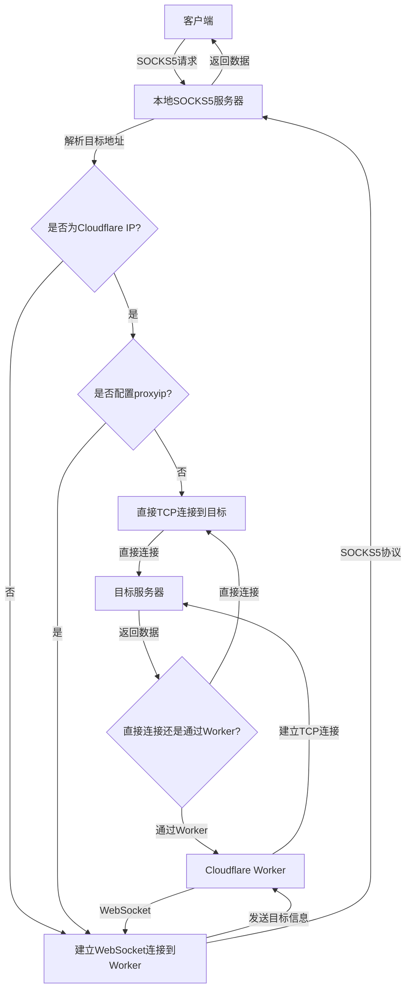

# CF-Worker-Socks

### 基于 Cloudflare Worker 的 SOCKS5 代理服务器

一个部署在 Cloudflare Worker 上的高性能、灵活可配置的代理工具

### 主要特点

- **基于 Cloudflare Worker**: 利用 Cloudflare 的全球网络,无需额外服务器即可部署
- **SOCKS5 协议支持**: 兼容性广泛,可用于各种应用程序
- **智能路由**: 自动识别 Cloudflare IP,根据目标地址选择最优连接路径
- **灵活配置**:
  - 可自定义 Worker IP 和端口
  - 支持指定域名强制走 Worker 代理
  - 可配置未被屏蔽的 Cloudflare IP 和端口
- **高性能**: 针对 Cloudflare IP 优化,可自动选择直连以提高速度
- **纯 Node.js 实现**: 无需依赖第三方软件,易于部署和维护
- **安全性**: 支持密码认证,保护代理服务不被未授权访问
- **错误处理**: 完善的错误处理机制,提高稳定性
- **日志记录**: 详细的日志记录,便于问题诊断和性能优化

### 连接原理流程图



### 工作原理详解

1. 客户端发送SOCKS5请求到本地SOCKS5服务器。
2. 本地服务器解析目标地址,判断是否为Cloudflare IP。
3. 如果是Cloudflare IP且未配置proxyip:
   - 直接建立TCP连接到目标地址。
4. 否则:
   - 建立WebSocket连接到Cloudflare Worker。
   - 通过Worker转发数据到目标地址。
5. 数据传输:
   - 如果是直接连接,数据直接在客户端和目标服务器之间传输。
   - 如果通过Worker,数据经由WebSocket和Worker中转。
6. 返回数据按原路径传回客户端。

这个流程确保了根据目标地址和配置,选择最优的连接路径,既能利用Cloudflare的全球网络,又能在可能的情况下实现直连以提高性能。

### 使用方法

1. 修改 `worker.js` 中的 `passwd` 变量,然后部署到 Cloudflare Worker

2. 部署完成后,在 Cloudflare Worker 中获取到域名

3. 在本地创建或修改 `config.json` 配置文件:

```json
{
  "domain": "your-worker-domain.example.com",
  "psw": "your-password",
  "sport": 1080,
  "sbind": "127.0.0.1",
  "wkip": "",
  "wkport": "",
  "proxyip": "",
  "proxyport": "",
  "cfhs": ["example.com", ""]
}
```

配置说明:
- `domain`: Worker 的域名(必填)
- `psw`: 与 Worker 中设置的密码一致(必填)
- `sport`: 本地 SOCKS5 代理端口(必填)
- `sbind`: 本地绑定地址,通常为 127.0.0.1(必填)
- `wkip`: 指定连接 Worker 的 IP(可选)
- `wkport`: 指定连接 Worker 的端口(可选)
- `proxyip`: 指定未被屏蔽的 Cloudflare IP(可选)
- `proxyport`: 指定未被屏蔽的 Cloudflare IP 端口(可选)
- `cfhs`: 指定强制走 Worker 代理的域名列表(可选)

4. 运行程序 `node cli.js`,本地会开启 SOCKS5 代理服务

5. 配置浏览器或其他应用程序使用该代理

### 高级配置

1. **自定义 Worker 连接**:
   - 设置 `wkip` 和 `wkport` 可以指定连接 Worker 的 IP 和端口
   - 这在某些网络环境下可能会提高连接稳定性和速度

2. **强制代理特定域名**:
   - 通过 `cfhs` 配置可以指定哪些域名强制通过 Worker 代理
   - 适用于需要特殊处理的网站或服务

3. **自定义 Cloudflare IP**:
   - 设置 `proxyip` 和 `proxyport` 可以指定使用特定的 Cloudflare IP 和端口
   - 在某些网络环境下,这可能会绕过一些限制或提高性能

### 性能优化

- 程序会自动缓存 DNS 解析结果,减少重复查询
- 对于 Cloudflare IP,会尝试直接连接以减少延迟
- 使用 WebSocket 长连接,减少连接建立的开销

### 安全性考虑

- 使用 HTTPS 和 WSS 协议确保数据传输的安全性
- 支持密码认证,防止未授权使用
- 建议定期更改密码,并使用强密码

### 故障排除

1. 如果连接失败,检查 `config.json` 中的配置是否正确
2. 确保 Cloudflare Worker 已正确部署且密码设置正确
3. 检查本地防火墙设置,确保允许程序访问网络
4. 查看控制台输出的日志信息,了解具体错误原因

### 推荐工具

- Windows 用户可使用 Proxifier 为指定程序强制使用代理
- 推荐使用 SwitchyOmega 等浏览器插件管理代理设置

### 贡献指南

欢迎提交 Issue 和 Pull Request 来改进这个项目。在提交 PR 时,请确保:

1. 代码风格一致
2. 添加必要的注释和文档
3. 更新 README 文件以反映新的��化

### 许可证

本项目采用 MIT 许可证。详情请参阅 [LICENSE](LICENSE) 文件。

### 免责声明

本工具仅供学习和研究使用。使用本工具时请遵守相关法律法规,不得用于非法用途。作者不对使用本工具导致的任何问题负责。
